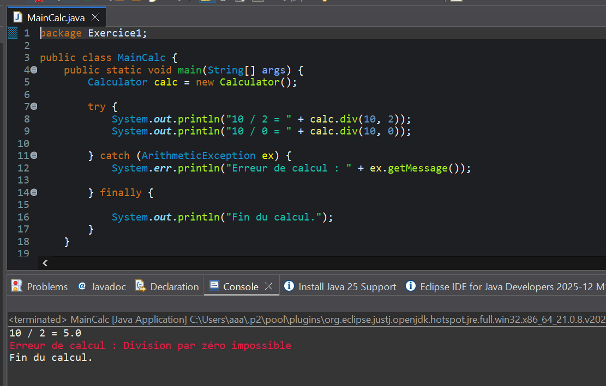
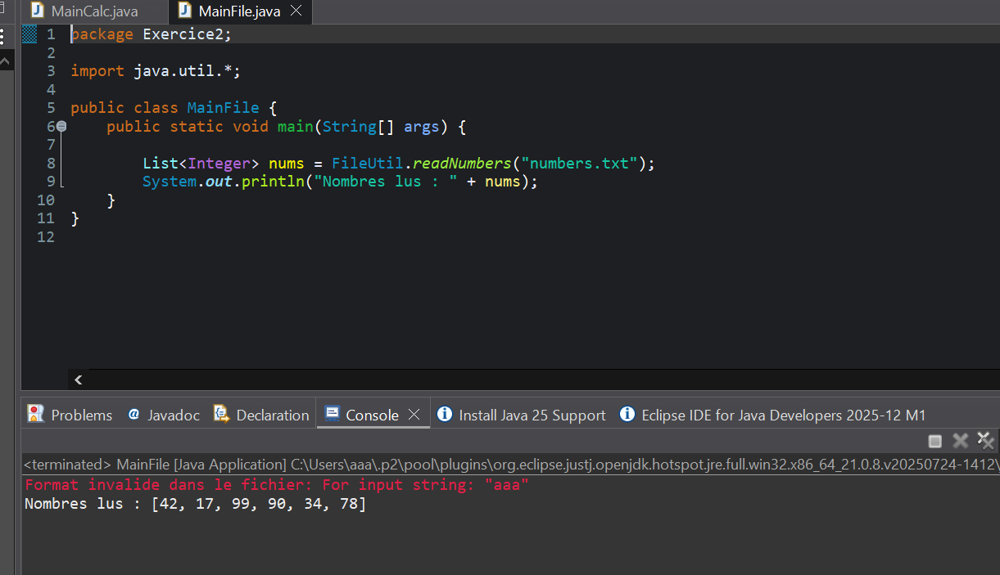
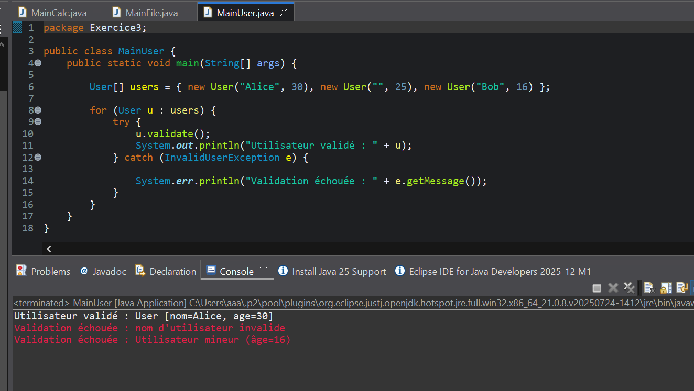
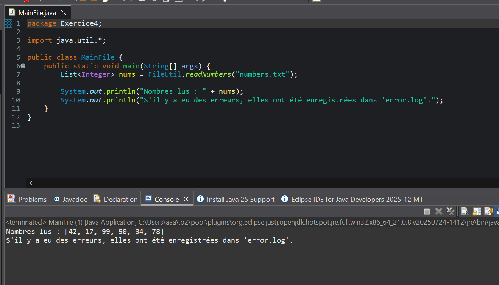

"#LES CAPTURES D'EXECUTION DU TP9_JAVA" 
# 🧠 TP9 - Programmation java

Ce projet contient les exercices du TP9 en java.

## 📸 Captures d’écrants

Voici les résultats d’exécution :
L'execution d'exercice 1 :

L'execution d'exercice 2 :

L'execution d'exercice 3 :

L'execution d'exercice 4 :


---

## ⚙️ Compilation
```bash
g++ main.cpp -o main
./main


